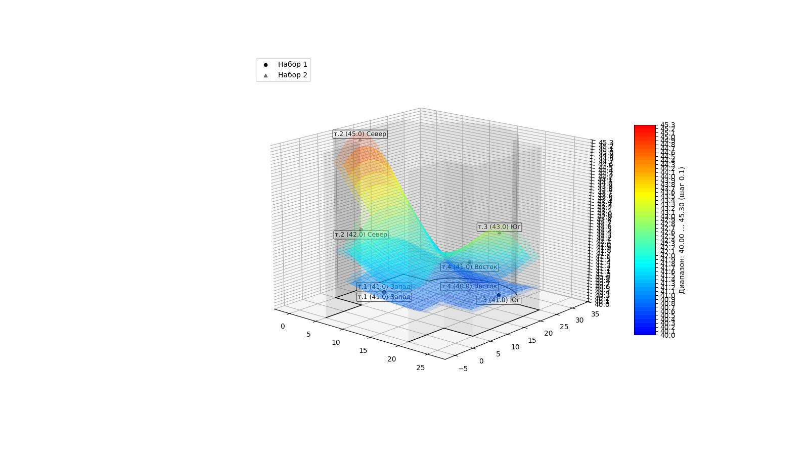

# ThermalVis of Indoor Environments

Визуализация 3D‑распределения температуры внутри помещения по температурам четырёх стен. Поддерживаются два набора
значений (например, "день" и "вечер") с:
- общим цветовым диапазоном (удобно сравнивать),
- регулируемой прозрачностью поверхностей,
- гарантированным вертикальным зазором между поверхностями (anti-slip),
- отрисовкой стен и контура пола помещения.

Под капотом: NumPy, SciPy (интерполяция), Matplotlib (3D‑визуализация).

---

## Требования

- Python 3.11–3.13.
- Poetry 2.x.
- Графическое окружение для окна Matplotlib.

Проверка окружения:
```bash
python --version
poetry --version
```

---

## Установка

```bash
git clone --recursive --depth=1 https://github.com/yourdisenchantment/ThermalVis-of-Indoor-Environments.git
cd ThermalVis-of-Indoor-Environments
poetry env use 3.13
poetry install
```

---

## Быстрый старт

Запуск из проекта (через Poetry)

- Интерактивно:
  ```bash
  poetry run thermalvis
  # Сначала спросит: сколько графиков (1/2),
  # затем точки в порядке: т.1 запад, т.2 север, т.3 юг, т.4 восток,
  # затем (опционально) шаг делений и прозрачность.
  ```

- Один набор (CLI):
  ```bash
  poetry run thermalvis -t 1 -n 20.5 -w 20.8 -s 21.1 -e 20.3
  ```

- Два набора (CLI): используйте разделитель наборов «\» как отдельный аргумент.
    - Bash/zsh (Linux/macOS): передавайте его как литерал в кавычках '\'
  ```bash
  poetry run thermalvis -t 2 \
    -n 20.1 -w 20.9 -s 20.5 -e 20.7 \
    '\' \
    -n 20.4 -w 21.2 -s 20.8 -e 21.0 \
    --min-gap 0.1 --alpha 0.4
  ```
    - PowerShell (Windows): перенос строк - обратная кавычка `, разделитель - просто \
  ```powershell
  poetry run thermalvis -t 2 `
    -n 20.1 -w 20.9 -s 20.5 -e 20.7 `
    \ `
    -n 20.4 -w 21.2 -s 20.8 -e 21.0 `
    --min-gap 0.1 --alpha 0.4
  ```

Подсказки

- --tick-step <шаг> управляет делениями по оси Z и на цветовой шкале (например, 0.05 для более частых делений).
- --min-gap - вертикальный зазор между поверхностями (anti-slip), а не шаг делений.
- Headless экспорт:
  - Linux/macOS:
    ```bash
    MPLBACKEND=Agg poetry run thermalvis -t 1 -n 20.5 -w 20.8 -s 21.1 -e 20.3 --no-show --save plot.png
    ```
  - Windows PowerShell:
    ```powershell
    $env:MPLBACKEND="Agg"
    poetry run thermalvis -t 1 -n 20.5 -w 20.8 -s 21.1 -e 20.3 --no-show --save plot.png
    ```

---

## CLI справка

```bash
poetry run thermalvis --help
```

Основные опции:

- -t, --type {1,2} - количество графиков (1 или 2).
- Наборы значений:
    - Для каждого набора: -n/--north, -w/--west, -s/--south, -e/--east.
    - Между наборами поставьте отдельным аргументом символ «\».
- Визуализация:
    - --min-gap <float>    - минимальный вертикальный зазор между поверхностями (напр., 0.05 или 0.1).
    - --alpha <float>      - прозрачность поверхностей (0..1), по умолчанию 0.4.
    - --tick-step <float>  - шаг делений по оси Z и на colorbar (напр., 0.1 или 0.05).
    - --no-show - не открывать окно (полезно в CI/сервере).
    - --save <path>        - сохранить изображение (PNG/PDF/SVG).

---

## Примеры

Ниже примеры для bash/zsh (Linux/macOS) с разделителем наборов как литерал '\'.

Temp 1
```bash
poetry run thermalvis -t 2 \
  -n 20.1 -w 20.0 -s 20.4 -e 18.8 \
  '\' \
  -n 20.2 -w 20.0 -s 20.5 -e 20.0 \
  --min-gap 0.05 --alpha 0.4
```


Phi 1

```bash
poetry run thermalvis -t 2 \
  -n 51 -w 50 -s 51 -e 50 \
  '\' \
  -n 52 -w 50 -s 52 -e 50 \
  --min-gap 0.5 --alpha 0.4
```


---

Temp 2

```bash
poetry run thermalvis -t 2 \
  -n 25.2 -w 24.2 -s 25.4 -e 24.5 \
  '\' \
  -n 24.8 -w 24.0 -s 25.0 -e 25.9 \
  --min-gap 0.05 --alpha 0.4
```


Phi 2
```bash
poetry run thermalvis -t 2 \
  -n 54 -w 52 -s 53 -e 47 \
  '\' \
  -n 53 -w 52 -s 53 -e 52 \
  --min-gap 0.5 --alpha 0.4
```


---

Temp 3

```bash
poetry run thermalvis -t 2 \
  -n 23.3 -w 23.3 -s 24.0 -e 22.5 \
  '\' \
  -n 24.0 -w 22.8 -s 24.3 -e 23.1 \
  --min-gap 0.05 --alpha 0.4
```


Phi 3

```bash
poetry run thermalvis -t 2 \
  -n 39 -w 39 -s 35 -e 41 \
  '\' \
  -n 39 -w 40 -s 35 -e 39 \
  --min-gap 0.5 --alpha 0.4
```


---

Temp 4

```bash
poetry run thermalvis -t 2 \
  -n 22.4 -w 22.0 -s 22.4 -e 22.2 \
  '\' \
  -n 22.8 -w 22.1 -s 22.8 -e 22.6 \
  --min-gap 0.05 --alpha 0.4
```


Phi 4

```bash
poetry run thermalvis -t 2 \
  -n 42 -w 41 -s 41 -e 41 \
  '\' \
  -n 45 -w 41 -s 43 -e 40 \
  --min-gap 0.5 --alpha 0.4
```


